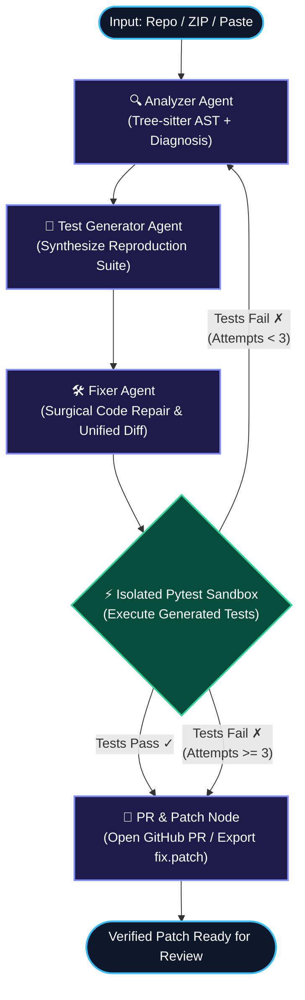

<div align="center">

# ⚡ DebugFlow AI
### Autonomous Multi-Agent Code Debugger & PR Patch Generator

[](https://www.python.org/)
[](https://github.com/langchain-ai/langgraph)
[](https://tree-sitter.github.io/)
[](https://gradio.app/)
[-brightgreen.svg?logo=pytest&logoColor=white)](https://pytest.org/)
[](LICENSE)

**An orchestrated swarm of specialized AI agents that parses syntax trees, isolates defects, synthesizes reproducing pytest suites, applies surgical repairs, verifies fixes in an isolated sandbox, and automatically creates GitHub Pull Requests or downloadable `.patch` files.**

[Live Web Demo](#-live-deployment-guide) • [Architecture](#-system-architecture) • [Quickstart](#-quickstart-guide) • [Docker Deployment](#-docker-deployment) • [Test Suite](#-automated-testing)

---

</div>

## 🌟 Overview

Debugging complex codebases is traditionally slow and error-prone. **DebugFlow AI** automates the entire debugging lifecycle through an autonomous, state-driven multi-agent pipeline:

1. **Ingest Defect Context**: Upload a `.zip` project, link any public GitHub repository, or paste raw code and error logs.
2. **AST-Guided Root Cause Diagnosis**: The **Analyzer Agent** combines LLM reasoning with **Tree-sitter concrete syntax trees** to identify the exact faulty function and snap line boundaries to syntax nodes.
3. **Automated Reproduction**: The **Test Generator Agent** synthesizes targeted pytest suites that reproduce the bug before fixing.
4. **Surgical Repair**: The **Fixer Agent** generates minimal, non-destructive code patches and computes standard unified diffs.
5. **Isolated Runtime Verification**: An ephemeral pytest sandbox tests candidate fixes with a timeout to guard against regressions.
6. **Cyclical Self-Correction**: If verification fails, the runtime feeds the exact pytest error trace back to the Analyzer for up to 3 automated retry attempts.
7. **Export Pull Request or Patch**: Automatically opens a Pull Request on GitHub (with PR description and diff) or provides a 1-click in-browser downloadable `fix.patch` file.

---

## 🔄 System Architecture

The multi-agent workflow is modeled as a state machine compiled with **LangGraph**:



---

## 👥 Multi-Agent Swarm Breakdown

| Agent / Node | Role | Core Technology | Key Files |
|---|---|---|---|
| **🔍 Analyzer Agent** | Parses AST, traces traceback coordinates, snaps function line ranges, and identifies root cause. | `tree-sitter`, `tree-sitter-python`, `ast`, LLM | [`src/agents/analyzer.py`](src/agents/analyzer.py)<br>[`src/tools/code_parser.py`](src/tools/code_parser.py)<br>[`src/prompts/analyzer.md`](src/prompts/analyzer.md) |
| **🧪 Test Generator** | Synthesizes targeted pytest test cases reproducing the defect on unpatched code. | `pytest`, `tempfile`, LLM | [`src/agents/test_generator.py`](src/agents/test_generator.py)<br>[`src/prompts/test_generator.md`](src/prompts/test_generator.md) |
| **🛠️ Fixer Agent** | Applies minimal code repairs, preserves style and comments, and computes unified diff. | `difflib`, multi-key JSON parsing, LLM | [`src/agents/fixer.py`](src/agents/fixer.py)<br>[`src/prompts/fixer.md`](src/prompts/fixer.md) |
| **⚡ Isolated Verifier** | Executes tests in an ephemeral directory with mirrored packages and `PYTHONPATH` isolation. | `subprocess`, `pytest`, `tempfile` | [`src/tools/test_runner.py`](src/tools/test_runner.py) |
| **🚀 PR & Patch Generator** | Authenticates with GitHub to push a branch and open a PR, or writes `output/fix.patch`. | `PyGithub`, Git | [`src/tools/git_pr.py`](src/tools/git_pr.py) |
| **🌐 Web Interface** | Modern cybernetic UI with real-time activity stream, animated pipeline status, and patch download. | `gradio`, HTML5, CSS3, JavaScript | [`app.py`](app.py) |

---

## 📦 Shared State Contract (`src/state.py`)

All agents operate on an immutable, typed state contract:

```python
class DebugState(TypedDict, total=False):
    file_path: str          # Target file path being debugged
    source_code: str        # Original unpatched source code
    error_log: str          # Exception stack trace or test failure
    analysis: dict          # Diagnosis: {root_cause, file, function, line_start, line_end}
    generated_tests: str    # Pytest reproduction suite
    fixed_code: str         # Full corrected Python code
    patch_diff: str         # Unified git diff
    test_passed: bool       # Verification status (True/False)
    test_output: str        # Pytest stdout/stderr output
    attempts: int           # Current retry iteration
    max_attempts: int       # Maximum retry budget (default: 3)
    pr_url: str             # GitHub PR URL or local patch path
    github_token: str       # Optional token for remote PR creation
    logs: list[str]         # Running telemetry log of agent actions
```

---

## 🚀 Quickstart Guide

### 1. Clone & Set Up Virtual Environment

```bash
# Clone the repository
git clone https://github.com/bhaveshk25/MultiAgent-Ai-code-debugger-and-PR-patch-Generator.git
cd MultiAgent-Ai-code-debugger-and-PR-patch-Generator

# Create and activate virtual environment
python3 -m venv .venv
source .venv/bin/activate  # On Windows: .venv\Scripts\activate

# Install dependencies
pip install -r requirements.txt
```

### 2. Configure API Keys (`.env`)

Copy `.env.example` to `.env` and add your credentials:

```bash
cp .env.example .env
```

```env
# LLM Provider Key (Groq, Gemini, OpenRouter, or local Ollama)
GROQ_API_KEY=gsk_your_groq_api_key_here

# Optional: GitHub Integration (If omitted, DebugFlow exports a downloadable .patch)
GITHUB_TOKEN=ghp_your_personal_access_token_here
```

### 3. Launch the Web Interface

```bash
PYTHONPATH=. python app.py
```

Open your browser at **`http://127.0.0.1:7860`**.

---

## 🖥️ Professional Developer Interface

DebugFlow AI features a clean, high-performance UI inspired by modern developer platforms like Linear, Vercel, and Cursor:

- **🌓 Instant Light & Dark Mode**:
  - Full support for both dark and light modes with instant switching and persistent `localStorage` preference memory.
  - High-contrast, accessibility-tested typography and card borders in both themes.
- **⚡ Live Swarm Telemetry & Architecture**:
  - Real-time telemetry dashboard monitoring the 5 coordinated agents (`Analyzer` → `Test Generator` → `Fixer` → `Verifier` → `Dispatcher`).
  - Active retry budget countdown (3 loop cycles) and 100% sandbox isolation telemetry.
- **💻 macOS-Style Developer Console**:
  - High-contrast live activity log with window controls (traffic light dots), timestamped events, and JetBrains Mono monospace formatting.
- **📥 Ingestion Modes**:
  - **Paste Code**: Direct code and traceback pasting with instant demo loader (`✨ Load Demo Bug`).
  - **Upload Project**: Upload `.zip` or `.py` archives; automatically unpacks and auto-detects failing tests.
  - **GitHub Repository**: Enter any public repository URL (`https://github.com/owner/repo`) and branch; auto-discovers files and test suites.
- **📊 Verified Repair Artifacts**:
  - **Analysis Tab**: Structured cards displaying targeted function, file coordinates, and root cause diagnosis.
  - **Generated Tests Tab**: Runnable pytest code synthesized by the agents.
  - **Fixed Code Tab**: Complete corrected Python source code.
  - **Patch Tab**: Standard unified git diff format (`--- a/file` / `+++ b/file`).
  - **Verification Tab**: Execution log and pass/fail summary from isolated pytest.
  - **Pull Request Tab**: Clickable GitHub PR link or an **in-browser 1-click Download button** for `fix.patch` with `git apply` instructions.

---

## 🌐 Live Deployment Guide

### Option 1: Deploy to Hugging Face Spaces (Instant & Free)

Because this repository contains the Hugging Face YAML metadata in `README.md`, you can deploy it in 60 seconds:

1. Create a new Space on [Hugging Face](https://huggingface.co/new-space).
2. Choose **Gradio** as the SDK.
3. Push this repository to your Hugging Face Space remote:
   ```bash
   git remote add space https://huggingface.co/spaces/<your-username>/<your-space-name>
   git push space main
   ```
4. In Space Settings, add your Secret: `GROQ_API_KEY`.
5. Your application is live worldwide!

---

### Option 2: Deploy with Docker (Render, Railway, AWS, DigitalOcean)

A production-ready [`Dockerfile`](Dockerfile) is included:

```bash
# Build Docker image
docker build -t debugflow-ai .

# Run container on port 7860
docker run -d -p 7860:7860 --env-file .env --name debugflow debugflow-ai
```

Access the app at `http://localhost:7860`.

---

## 🧪 Automated Testing

DebugFlow AI includes comprehensive unit and integration tests covering parser boundary snapping, AST coordinate validation, markdown fence stripping, retry loops, and patch generation:

```bash
PYTHONPATH=. pytest tests/ -v
```

```text
============================= 29 passed in 1.15s ==============================
✓ test_analyzer_empty_source_code_raises_error
✓ test_analyzer_missing_error_log_proceeds
✓ test_analyzer_off_by_one_cart_total
✓ test_analyzer_snaps_lines_to_treesitter_boundaries
✓ test_analyzer_retry_with_test_output
✓ test_code_parser_function_listing
✓ test_code_parser_function_extraction
✓ test_code_parser_class_method
✓ test_code_parser_large_source_file
✓ test_code_parser_nested_and_async_functions
✓ test_fixer_generates_fixed_code_and_patch_diff
✓ test_fixer_cleans_markdown_fences
✓ test_fixer_incorporates_retry_test_output
✓ test_open_pr_fallback_when_no_token
✓ test_open_pr_with_mocked_pygithub
✓ test_repo_loader_detect_failing_tests
...
```

---

## 💡 How to Apply Generated Patches

If you download `fix.patch` via the web UI without configuring a GitHub token:

```bash
# In your local repository:
git apply fix.patch

# Create a branch and commit the fix:
git checkout -b fix-defect
git commit -am "fix: automated repair from DebugFlow AI"
git push -u origin fix-defect
```

---

## 📄 License

This project is licensed under the [MIT License](LICENSE).
Developed with ❤️ by **Team ZeroIQ**.
